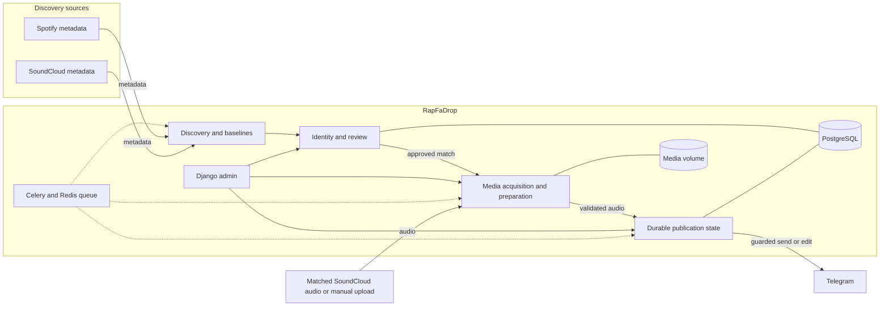

# RapFaDrop

RapFaDrop is a self-hosted Persian rap release monitor and Telegram publishing system for an owner-curated artist roster. It discovers release metadata, resolves recording identity, prepares verified complete audio and records publication state for safe retries and updates.

Spotify supplies discovery and metadata, not audio. Full recordings must come from a separately matched media source or an operator upload. Current production runs metadata discovery; ordinary automatic publication is disabled. A separately authorized Popular-track archive has published a subset of its frozen selections and is now paused. See [current status](docs/STATUS.md) for the latest evidence.

## Capabilities

- Independent source polling, historical baselines, stable native IDs and per-source backoff. Initial baselines do not publish old releases.
- Canonical recording identities across platforms, duplicate protection, prior-single/album linkage and operator review for ambiguous matches.
- Bounded media acquisition, authenticated manual upload, completeness checks, measured audio properties, embedded artwork and configurable tags.
- Durable Telegram attempts, ordered album delivery after full staging, resumable cursors and same-message audio/caption updates. Uncertain delivery requires reconciliation before retrying.
- A private Django operator panel with separate accounts, audited actions, queue/error views and versioned caption/settings previews.
- Encrypted operational backups with isolated restore checks, dedicated Telegram backup uploads and scheduled retention.

## Architecture



Django owns product data and operator actions; Celery handles scheduled work. PostgreSQL is authoritative for identities, baselines, reviews, attempts and Telegram message bindings. Redis carries transient work. The private media volume holds working files; retention and cleanup depend on the workflow. The explicit archive collection uses a separate CLI and scoped production gateway, rather than the ordinary publication scheduler. Arrows describe implemented paths, not which services are currently enabled.

## Technology stack

| Area | Technology |
| --- | --- |
| Application and admin | Python 3.13, Django 5.2 LTS, Gunicorn, WhiteNoise |
| Durable state and jobs | PostgreSQL 17, Redis 8, Celery worker and beat |
| Discovery | Replaceable SoundCloud and SpotifyScraper adapters |
| Media | yt-dlp, FFmpeg/ffprobe, Mutagen, Pillow |
| Delivery and runtime | Telegram Bot API, Docker Compose; age and systemd for host backups |

Python dependencies are pinned in [requirements.txt](requirements.txt); service images and build steps are in [compose.yaml](compose.yaml) and [Dockerfile](Dockerfile).

## Local Docker quick start

Requires Docker with Compose. Run these PowerShell commands from the repository root. Create an ignored local `.env` from [.env.example](.env.example), then replace `DJANGO_SECRET_KEY` and `POSTGRES_PASSWORD` with independently generated secrets before starting.

```powershell
if (-not (Test-Path .env)) { Copy-Item .env.example .env }
# Edit .env and replace both placeholder secrets.
docker compose config --quiet
docker compose up --build -d
docker compose exec web python manage.py migrate --noinput
docker compose exec web python manage.py check
docker compose exec web python manage.py manage_operator localadmin
Invoke-RestMethod http://localhost:8000/health/
```

The account command prompts for a password. Open the operator panel at [localhost:8000/admin/ops/](http://localhost:8000/admin/ops/); the Django admin is at `/admin/`. The health endpoint checks database connectivity.

Optionally import the approved roster offline:

```powershell
docker compose exec -T web python manage.py seed_sources --dry-run
docker compose exec -T web python manage.py seed_sources
```

Import preserves existing curated settings and creates new records disabled. It does not poll providers, acquire audio or publish messages. Verification, baselining and activation are separate operations.

## Configuration and operations

Keep the full configuration from `.env.example`. This secret-free subset shows the safe local defaults:

```dotenv
DJANGO_DEBUG=false
DJANGO_ALLOWED_HOSTS=localhost,127.0.0.1
RAPFADROP_SPOTIFY_DISCOVERY_MODE=unavailable
RAPFADROP_SPOTIFY_MEDIA_BRIDGE_ENABLED=false
RAPFADROP_MEDIA_PROVIDER_ORDER=yt-dlp
RAPFADROP_TELEGRAM_MODE=disabled
RAPFADROP_TELEGRAM_LIVE_ENABLED=false
RAPFADROP_PUBLICATION_WORKER_ENABLED=false
```

| Setting | Purpose |
| --- | --- |
| `RAPFADROP_SPOTIFY_DISCOVERY_MODE` | `spotifyscraper` selects the implemented metadata adapter; `unavailable` is the local default. |
| `RAPFADROP_SPOTIFY_MEDIA_BRIDGE_ENABLED` | Separately gates discovery-to-media processing; it does not enable Telegram delivery. |
| `RAPFADROP_MEDIA_*` | Controls storage, limits, provider order and fallback tag policy; versioned operator settings can override tag defaults. |
| `RAPFADROP_TELEGRAM_*` | Controls destination mode, live permission and private credentials. Isolated tests require explicit test configuration and confirmation. |
| `RAPFADROP_PUBLICATION_WORKER_ENABLED` | Separately enables ordinary publication recovery and correction-deletion scheduling when Telegram guards also allow it. |

Local Compose binds web to loopback and leaves PostgreSQL/Redis unpublished. Fresh defaults keep Spotify discovery unavailable and media/publication switches off. Production uses a separate internal Compose file plus protected overlays, credentials and a host backup timer. Use the [deployment runbook](docs/DEPLOYMENT.md) and latest status for production operations; local commands are not production deployment instructions.

Routine local commands:

```powershell
docker compose ps
docker compose logs --tail 100 web worker beat postgres redis
docker compose exec -T web python manage.py source_status
docker compose exec -T web python manage.py probe_telegram --configuration-status
docker compose exec -T web python manage.py test
docker compose down
```

The Telegram configuration-status command makes no Telegram request. `down` retains named database/media volumes; `down -v` removes them. Provider probes and live test sends are opt-in; their procedures are in the linked reports.

## Implementation status and limits

**Verified integrations.** Spotify metadata identity, complete catalog baselines and scheduled polling have been observed across the approved roster. A controlled historical replay verified Spotify discovery through reviewed SoundCloud audio acquisition to isolated Telegram single/album publication, including tags, artwork, byte readback, ordered delivery and restart recovery. This proves the tested samples, not universal audio coverage or live-release latency.

**Current operation.** Metadata discovery remains active. The discovery-to-media bridge and ordinary publication remain off. The separate Popular collection freezes selections, shares corroborated recording identities, persists attempts and supports scoped sends and same-message edits. Its published subset has verified final captions; the collection is paused and its acquisition service is stopped. Pending recordings retain explicit source, match, access or identity blockers. Counts, message IDs and deployed SHAs live in [STATUS](docs/STATUS.md) and [reports](docs/reports/).

**Captions and audio.** Templates are versioned, editable and previewed before activation; absent links are omitted. Current audio defaults use bold, channel-linked `Fave`, `Drop`, `LP Drop` or `EP Drop` headings with conditional platform/album links. Custom templates are preserved. Quality selection prefers validated complete MP3 near 320 kb/s when available, with complete compressed alternatives; observed SoundCloud samples include AAC. It does not guarantee native MP3 320, convert lower-quality audio to fabricate quality, or imply every track is downloadable. Ordinary media is retained for recovery/upgrades; the archive workflow permits disposable-file cleanup after confirmed readback while retaining durable provenance.

**Open gates.** YouTube acquisition code exists, but current recorded evidence does not establish a working YouTube audio pipeline; it shares yt-dlp and is not a verified independent downloader fallback. SoundCloud profile polling has encountered HTTP 403 even where individual recordings worked. Automatic matching and live-release latency are not generally established. Admin poll/baseline buttons record requests without an executor, notification settings are placeholders, and full production HTTPS remains an operational gate.

**Backups.** Host tooling encrypts consistent database/configuration snapshots, checks isolated restores and uploads to a dedicated backup channel. The daily timer and local retention of seven daily/four weekly verified snapshots are implemented and observed. Backups exclude audio files and Redis queues. Large-part Telegram download verification is limited; the owner must save the recovery identity independently. See the [recovery runbook](ops/BACKUP_RESTORE.md).

## Detailed documentation

- [Status and handoff](docs/STATUS.md) — latest recorded operation, evidence and outstanding gates.
- [Product specification](docs/PRODUCT_SPEC.md) and [implementation guide](docs/IMPLEMENTATION.md) — rules, data model and workflows; historical sections retain earlier milestone observations.
- [Artist roster](docs/ARTIST_ROSTER.md) and [source activation](docs/reports/SOURCE_ACTIVATION.md) — identity provenance and discovery coverage.
- [Spotify-to-Telegram verification](docs/reports/SPOTIFY_E2E.md), [Popular collection](docs/reports/POPULAR_TRACK_COLLECTION.md) and [final captions](docs/reports/FINAL_AUDIO_CAPTIONS.md) — empirical scope and limitations.
- [Deployment](docs/DEPLOYMENT.md) and [backup/restore](ops/BACKUP_RESTORE.md) — protected configuration, deployment and recovery procedures.
- [Agent instructions](AGENTS.md) — contributor entry point and authorized task boundaries.
